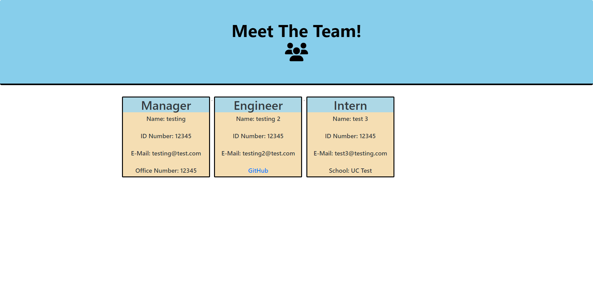

# John Kang, Module 10; Team Generator 

## Description

The purpose of this assignment was to use object oriented programming to generate a template that can create an HTML file containing information about the users team. I used Node and Inquirer to test and prompt the user with different questions about the team. 

The application we prompt questions about differnt positions and some general information such as their name, id number, email, and role. Depending on the role, inquirer will prompt specific questions about that specific role. Manager will be asked about their office number, engineer will be asked to provide their GIthub user id, and interns will be asked to provide the name of the school they are attending. 

Once the user as added all the members of the team, the application will create an HTML file containing information about the team. 

## Screenshot of Deployed Website

### Link to the demo video 
https://www.youtube.com/watch?v=4tU_HiME-fs&ab_channel=JohnKang